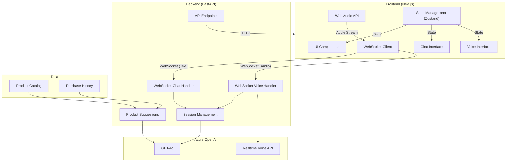

# Contoso Voice Agent

A sophisticated AI-powered voice and text assistant for Contoso Outdoors that provides personalized product recommendations and customer support through natural conversations.

## Project Overview

The Contoso Voice Agent combines text chat and voice calling capabilities to help customers discover and purchase outdoor gear. It serves as a retail assistant for Contoso Outdoor Company, creating an interactive and responsive shopping experience through AI-driven conversations.

## Architecture



## Components

### Frontend (web/)

- **Chat Interface**: Real-time text conversations with AI assistant
- **Voice Interface**: Interactive voice calling system with real-time audio processing
- **Web Audio API Integration**: Audio capture, processing, and playback
- **State Management**: Zustand stores for global state
- **WebSocket Communication**: Real-time message exchange with backend
- **UI Components**: React components with TypeScript for the product catalog and interactions

### Backend (api/)

- **FastAPI Application**: Main backend service with WebSocket support
- **Session Management**: Maintains the WebSocket connection to the web client and the Realtime API client
- **AI Integration**: Connects to Azure OpenAI for natural language processing
- **Voice Processing**: Realtime API integration for voice conversations
- **Product Suggestions**: AI-powered product recommendation engine

### Data

- **Product Catalog**: Information about outdoor products
- **Purchase History**: User purchase records for personalization
- **Conversation Context**: Maintaining conversation state across sessions

### AI Integration

- **Azure OpenAI GPT-4o**: Powering intelligent conversations
- **Realtime API**: Enabling voice interactions
- **Prompt Engineering**: Structured prompts for different conversation scenarios

## Technologies

- **Frontend**:
  - Next.js 
  - TypeScript
  - React
  - Web Audio API
  - Zustand (State Management)
  - WebSocket Client

- **Backend**:
  - Python
  - FastAPI
  - WebSockets
  - Azure OpenAI Client
  - Pydantic (Data Models)

- **AI & Integration**:
  - Azure OpenAI GPT-4o
  - Azure OpenAI Realtime API
  - Prompty Framework

## Features

- Real-time text chat with AI assistant
- Voice calling with natural language processing
- Product recommendations based on conversation context
- Interactive product catalog browsing
- Session persistence for continuous conversations
- Real-time audio processing and transmission

## Development and Deployment

### Local Development

1. Backend:
   ```bash
   cd api
   pip install -r requirements.txt
   python main.py
   ```

2. Frontend:
   ```bash
   cd web
   npm install
   npm run dev
   ```

3. VS Code:
   The project includes VS Code launch configurations. You can simply press F5 in VS Code to start debugging both frontend and backend components simultaneously.

### Deployment

Both frontend and backend include Dockerfiles for containerized deployment:

- Frontend: `web/Dockerfile` (Exposes port 3000)
- Backend: `api/Dockerfile`

## Environment Configuration

Required environment variables:

- `AZURE_VOICE_ENDPOINT`: Azure OpenAI Voice API endpoint
- `AZURE_VOICE_KEY`: Azure OpenAI API key
- `LOCAL_TRACING_ENABLED`: Enable/disable local tracing (default: true)

## Contributing

Guidelines for contributing to this project:

1. **Fork & Pull Request**: Fork the repository and create pull requests for contributions.
2. **Coding Standards**: Follow the existing coding style and patterns in the repository.
3. **Testing**: Add/update tests for any new features or bug fixes.
4. **Documentation**: Update documentation to reflect any changes.
5. **Review Process**: All submissions require review before being merged.
6. **Issue First**: For major changes, open an issue for discussion before submitting a PR.
7. **Security**: Report security vulnerabilities privately to the repository owners.
