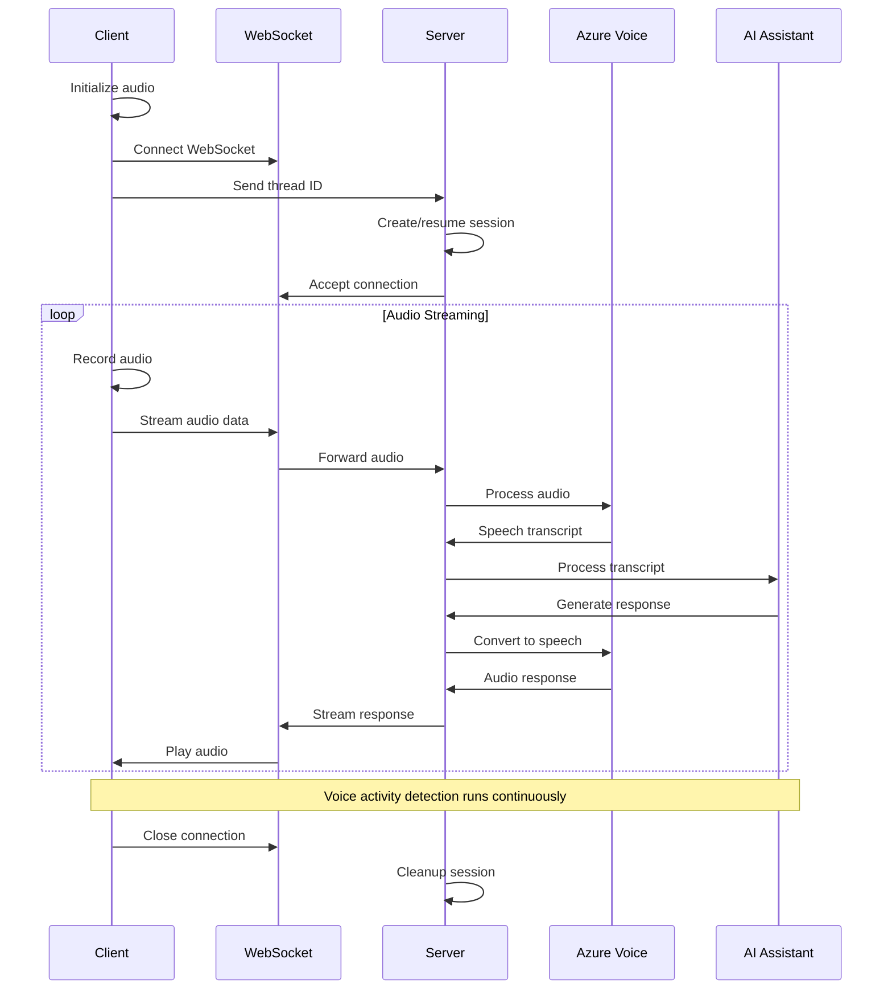
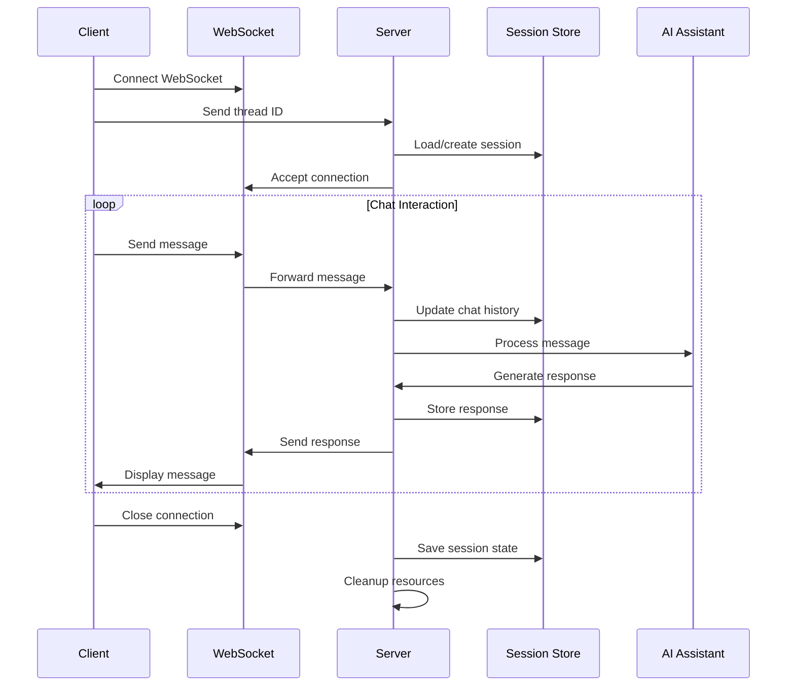
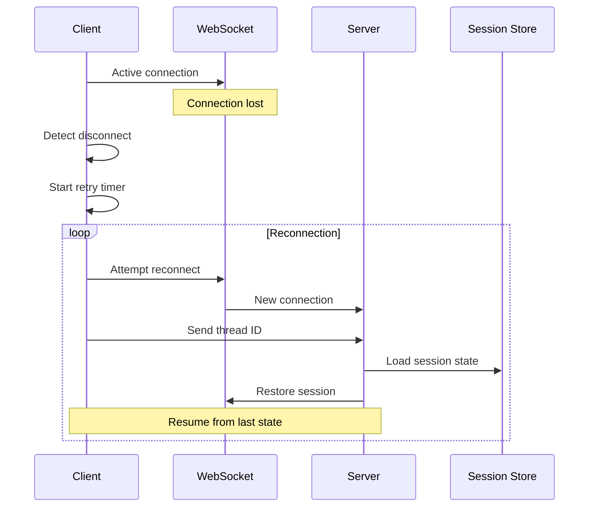
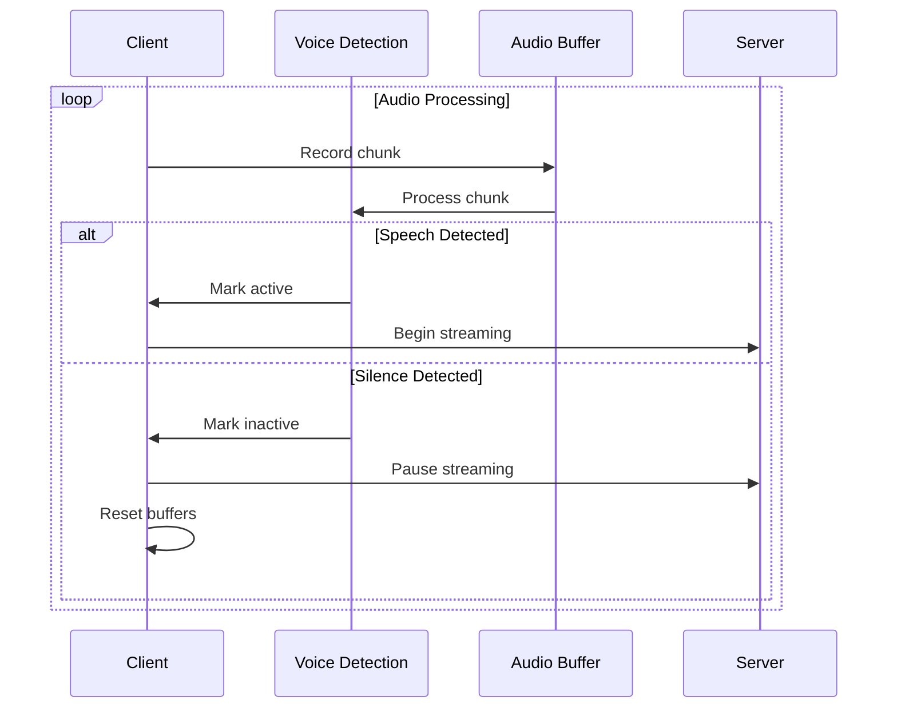

# Sequence Diagrams

## Voice Communication Flow

```mermaid
sequenceDiagram
    participant C as Client
    participant WS as WebSocket
    participant S as Server
    participant AV as Azure Voice
    participant AI as AI Assistant

    C->>C: Initialize audio
    C->>WS: Connect WebSocket
    C->>S: Send thread ID
    S->>S: Create/resume session
    S->>WS: Accept connection
    
    loop Audio Streaming
        C->>C: Record audio
        C->>WS: Stream audio data
        WS->>S: Forward audio
        S->>AV: Process audio
        AV->>S: Speech transcript
        S->>AI: Process transcript
        AI->>S: Generate response
        S->>AV: Convert to speech
        AV->>S: Audio response
        S->>WS: Stream response
        WS->>C: Play audio
    end

    Note over C,AI: Voice activity detection runs continuously
    
    C->>WS: Close connection
    S->>S: Cleanup session
```

## Text Chat Flow

```mermaid
sequenceDiagram
    participant C as Client
    participant WS as WebSocket
    participant S as Server
    participant DB as Session Store
    participant AI as AI Assistant

    C->>WS: Connect WebSocket
    C->>S: Send thread ID
    S->>DB: Load/create session
    S->>WS: Accept connection

    loop Chat Interaction
        C->>WS: Send message
        WS->>S: Forward message
        S->>DB: Update chat history
        S->>AI: Process message
        AI->>S: Generate response
        S->>DB: Store response
        S->>WS: Send response
        WS->>C: Display message
    end

    C->>WS: Close connection
    S->>DB: Save session state
    S->>S: Cleanup resources
```

## Error Recovery Flow

```mermaid
sequenceDiagram
    participant C as Client
    participant WS as WebSocket
    participant S as Server
    participant DB as Session Store

    C->>WS: Active connection
    Note over WS: Connection lost
    C->>C: Detect disconnect
    C->>C: Start retry timer
    
    loop Reconnection
        C->>WS: Attempt reconnect
        WS->>S: New connection
        C->>S: Send thread ID
        S->>DB: Load session state
        S->>WS: Restore session
        Note over C,S: Resume from last state
    end
```

## Real-time Processing Flow

```mermaid
sequenceDiagram
    participant C as Client
    participant VAD as Voice Detection
    participant AUD as Audio Buffer
    participant S as Server

    loop Audio Processing
        C->>AUD: Record chunk
        AUD->>VAD: Process chunk
        
        alt Speech Detected
            VAD->>C: Mark active
            C->>S: Begin streaming
        else Silence Detected
            VAD->>C: Mark inactive
            C->>S: Pause streaming
            C->>C: Reset buffers
        end
    end
```